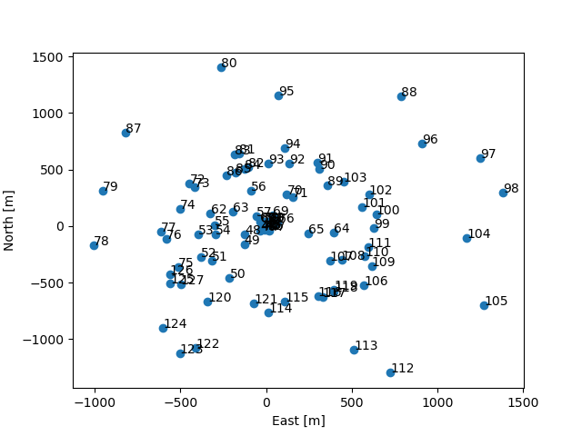
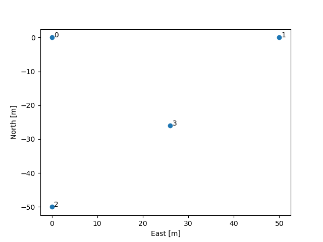
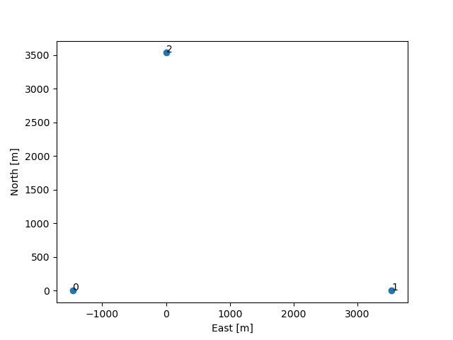

# Reference simulations

The goal of a reference simulation is to provide a simulated instrument output for a set of precisely defined inputs (sky model, antenna positions, primary beam, etc.) to serve as a point of comparison for other simulators and later versions of pyuvsim. Ideally, these tests should span multiple axes at once, but computational limitations in the earlier versions of pyuvsim prohibited this. Therefore, the version 1 reference simulations span these axes separately (e.g., time, frequency, baselines, sources), and each serve to test for different expected behavior.

## First Reference Simulations
 | Name (beam) | Purpose | 
 |:-----|:------|
 |1.1 | Test imaging and source orientation.|
 |1.2 (gauss) | Check that sources move appropriate and rise/set, and pass through the beam properly.|
 |1.2 (uniform) | Check that sources move appropriate and rise/set (stay visible near horizon). | 
 |1.3 (gauss) | Check that visibilities have sensible frequency evolution. Get observable fringes. Realistic primary beam.|
 |1.3 (uniform) | Check that visibilities have sensible frequency evolution. Get observable fringes. |
 |1.4 | Check phasing precision and simulate realistic data.|
 

### Details
|         Obsparam File         |                   Catalog                  | Ntimes | Nfreqs |     Layout    |        Beam       |    Results Filename    | 
|:-----------------------------:|:------------------------------------------:|:------:|:------:|:-------------:|:-----------------:|:----------------------:|
|     obsparam_ref_1.1.yaml     | mock_catalog_heratext_2458098.38824015.txt |    1   |    1   |   MWA_nocore  |      uniform      | ref_1.1_uniform.uvfits |      
|  obsparam_ref_1.2_gauss.yaml  |   two_distant_points_2458098.38824015.txt  |  86400 |    1   | Baseline-lite | 11° FWHM gaussian |  ref_1.2_gauss.uvfits  |     
| obsparam_ref_1.2_uniform.yaml |   two_distant_points_2458098.38824015.txt  |  86400 |    1   | Baseline-lite |      uniform      | ref_1.2_uniform.uvfits | 
|  obsparam_ref_1.3_gauss.yaml  |     letter_R_12pt_2458098.38824015.txt     |    2   |  64400 | Baseline-lite | 11° FWHM gaussian |  ref_1.3_gauss.uvfits  |
| obsparam_ref_1.3_uniform.yaml |     letter_R_12pt_2458098.38824015.txt     |    2   |  64400 | Baseline-lite |      uniform      | ref_1.3_uniform.uvfits |
|     obsparam_ref_1.4.yaml     |                  gleam.vot                 |    1   |    1   |  5km triangle | 11° FWHM gaussian | ref_1.4_uniform.uvfits | 

The total number of data points is constrained by the current level of optimization and availability of computing resources. pyuvsim is currently running on the Oscar cluster at Brown University, given limitations of memory and processor availability.

For a full description of how antenna layouts, instrument configuration, and catalogs are all written into parameter files, please see the documentation at https://pyuvsim.readthedocs.io/en/latest/parameter_files.html. As a quick summary: antenna layout is specified by a csv file, overall array configuration and primary beam assignments are defined by a yaml file, and catalogs are defined either by VOTable files or csv files. The "obsparam" yaml files define the simulations themselves, including the catalog, telescope configuration, array layout, and time/frequency array structures, as well as output filing information and any additional UVData parameters that may be desired.

### Catalogs

mock_catalog_heratext_2458098.38824015.txt:

   - This is a set of point sources near zenith at JD 2458098.38824015 for an observer at the HERA location. They spell out the word "HERA" from east to west across the sky with the tops of the letters to the north.

two_distant_points_2458098.38824015.txt:

   - This is two points near the opposite horizons at the specified julian date for an observer at the HERA location. This is chosen so that one source will rise and cross the sky for a given time, and we can see if the other sets appropriately.

letter_R_12pt_2458098.38824015.txt:

   - This is just the letter "R" from the HERA text catalog. It was chosen to have a smaller catalog with a recognizable orientation on the sky.

gleam.vot

   - The GLEAM catalog. It's too large to fit on github, so it's not included in the data directory, but it's on lustre.

### Antenna Layouts

MWA_nocore:

   - This is the MWA128 Phase I layout with the core 40 antennas removed (88 antennas remain).
   - The layout is written in mwa_nocore_layout.csv and the telescope configuration is in mwa88_nocore_config.yaml. The configuration specifies that all antennas have the unphysical "uniform" beam.

baseline-lite:

   - This consists of a right triangle of antennas with an additional antenna sqrt(2) meters off of the center of the hypotenuse. This provides a perfectly N-S and E-W and diagonal baselines, as well as some that don't perfectly fit the symmetry.
   - The layout is in baseline_lite.csv, and the bl_lite_gauss.yaml and bl_lite_uniform.yaml files respectively assign gaussian and uniform beams to all four antennas.

5km triangle:

   - An isosceles triangle consisting of two 5km baselines.
   - Layout and configuration (gaussian beam) are in 5km_triangle_layout.csv and 5km_triangle_config.yaml.

### Beams

Only two types of primary beams were used in these simulations: The uniform beam, which has unit response at all alt/az, and an 11° fwhm Gaussian beam. Both are AnalyticBeam objects.

### Other design choices

All simulations chose the HERA site as their telescope_location, for simplicity. This is lat/lon/alt (-30.72153°, 21.42831°, 1073.0 m). This includes the MWA128-like array (MWA_nocore).

## Old data

Results from previous iterations of the reference simulations are stored on the NRAO computing cluster, under `/lustre/aoc/projects/hera/ref\_sim/`.

## Comparison with PRISim
The PRISim simulator was designed with the intent of simulating wide field, high bandwidth interferometers specifically targeting 21 cm instruments. It has mainly been used in the context of a delay-spectrum style analysis, though images have been made and are known to be roughly correct. The data for this comparison can be found on the NRAO computing cluster at `/lustre/aoc/projects/hera/djacobs/prisim_ref/`.

- In the frequency domain, PRISim simulations agree at 10^-5 with pyuvsim, with quantization type errors at 10^-6.
- The difference shows a floor in the delay spectrum at 1e-6 which is above the expected Blackman-Harris floor at 1e-10
- In the image domain a phase offset at roughly the psf size and can be traced to differences in uvw calculation.  Antenna positions agree to tolerance which suggests uvw difference is related to phasing.  PRISim and pyvusim use different codes for phasing and time calculation. The PRISim phasing code is not covered with analytic tests.
